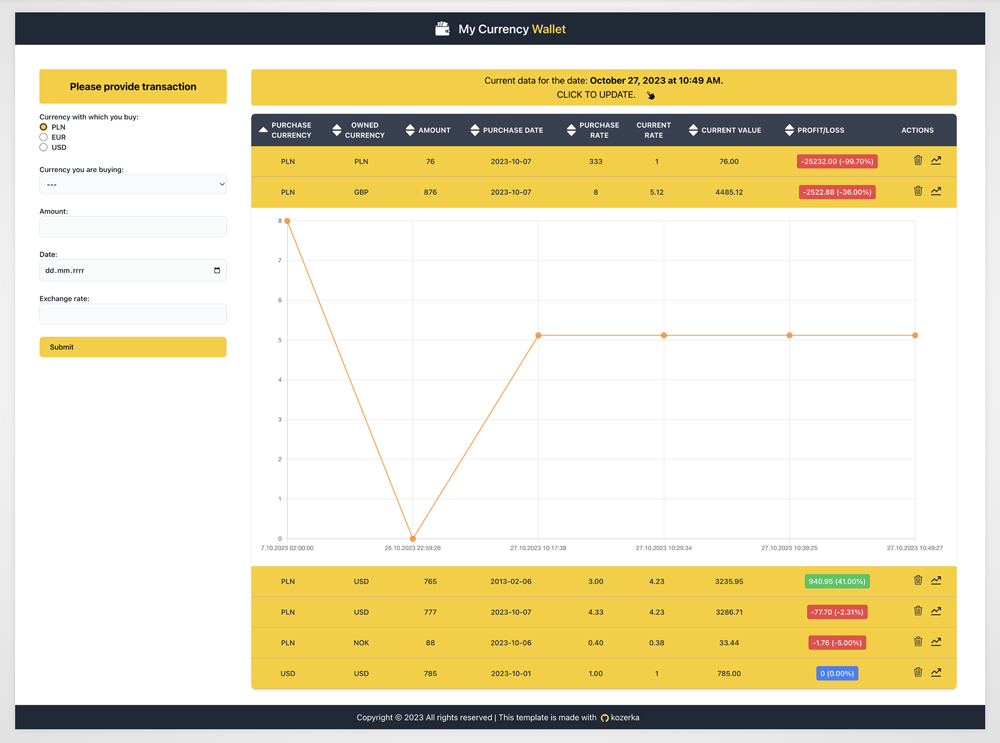
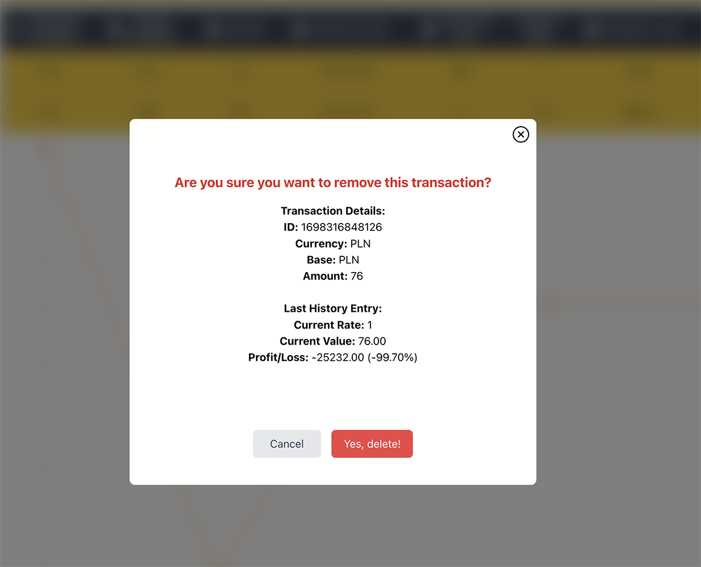

# Exchange Wallet Application

## Overview

The Exchange Wallet application is a comprehensive tool designed for users to manage currency transactions. It provides functionalities such as adding, updating, and safely deleting transactions. The application fetches real-time exchange rates from an external API, ensuring that users always have the most up-to-date information.

<p align="center">
  
</p>

## Technology Stack

     

## Features

1. **Real-time Exchange Rates**: The application fetches real-time exchange rates from an external API, allowing users to see the current value of their transactions.
2. **Transaction Management**: Users can add new transactions, update existing ones, and safely delete them.
3. **Transaction History with Charts**: For each transaction, the application maintains a history of API queries, letting users track the value of their transactions over time. This history is visually represented using `react-charts`, providing an intuitive graphical representation of transaction values over time.
4. **Safe Deletion with Confirmation**: To prevent accidental deletions, the application provides a modal confirmation window when a user attempts to delete a transaction.
5. **Form Validation**: The application ensures that all input fields are correctly filled out before a transaction can be added or updated.
6. **Persistent Data with LocalStorage**: All transaction data is stored in the browser's localStorage, ensuring that user data remains intact even after closing the browser or refreshing the page.

<p align="center">
  
</p>

## Configuration

### API Key Setup

ENV_SETUP.md included - with detailed info about API and configuration.

The application relies on an external API to fetch exchange rates. In short to set up the API:

1. Obtain an API key from the respective service provider.
2. Create a `.env` file in the root directory of the project.
3. Add the API key to the `.env` file as follows:
   ```
   REACT_APP_API_KEY=your_api_key_here
   ```
4. Save the `.env` file. The application will now use this key to authenticate with the external service.


> **Note**: Always keep your API keys confidential. Do not expose them in the client-side code or public repositories.

## Getting Started

1. Clone the repository:
   ```
   git clone [repository_url]
   ```
2. Navigate to the project directory:
   ```
   cd exchange-wallet
   ```
3. Install the required dependencies:
   ```
   npm install
   ```
4. Start the application:
   ```
   npm start
   ```
5. Configure .env file
   
The application will now be running on `http://localhost:3000`.

## Contributing

If you'd like to contribute, please fork the repository and make changes as you'd like. Pull requests are warmly welcome.

## Feedback

If you have any feedback or issues, please open an issue in this repository.

## License

[MIT](https://choosealicense.com/licenses/mit/)

---

Created with ❤️ by [kozerka].

---

&nbsp;

## 🙏 Special Thanks

A heartfelt thank you to my [Mentor - devmentor.pl](https://devmentor.pl/) for setting forth this challenge.

---